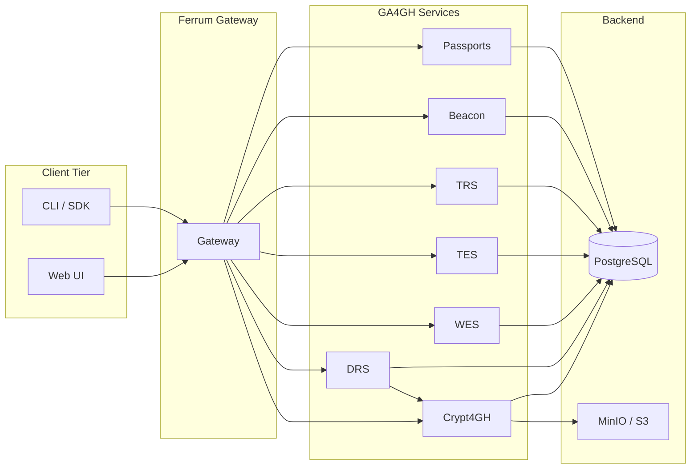
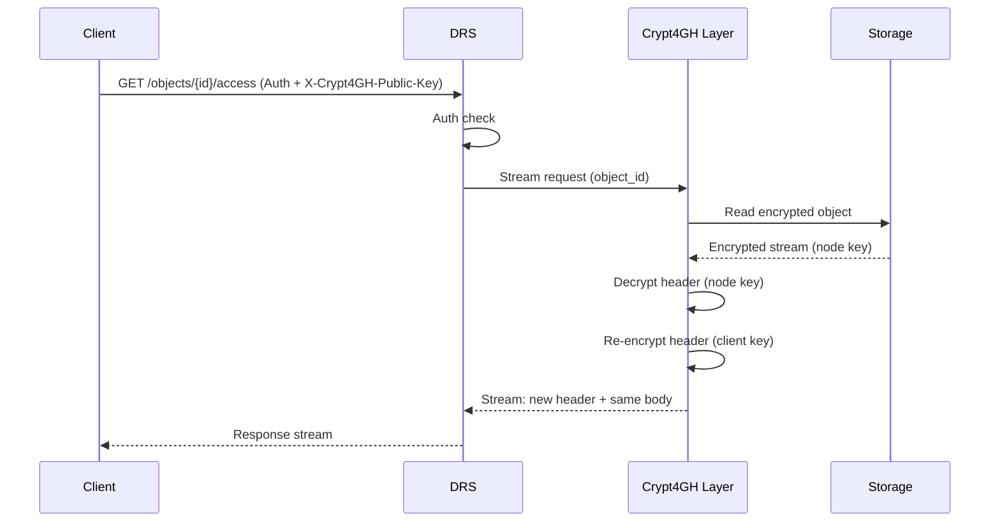

# Ferrum

<!-- logo placeholder -->
<p align="center"><strong>Ferrum</strong></p>

[](https://github.com/SynapticFour/Ferrum/actions/workflows/ci.yml)
[](LICENSE)
[](https://www.ga4gh.org/)
[](https://www.rust-lang.org/)
[](https://hub.docker.com/r/ferrum/gateway)

**Sovereign bioinformatics infrastructure. GA4GH-native. On-premises first. Built in Rust.**

---

## Why Ferrum?

| Problem | Solution |
|--------|----------|
| **Cloud lock-in** | Runs entirely on your hardware — no vendor SaaS required. |
| **Vendor APIs** | Full [GA4GH](https://www.ga4gh.org/) standard compatibility so you interoperate with the global ecosystem. |
| **Plaintext data** | Zero-plaintext [Crypt4GH](https://www.ga4gh.org/news_item/crypt4gh-encryption-standard/) encryption at rest and per-requester re-encryption on download. |

---

## Features

| | Feature |
|---|--------|
| 🔐 | **Transparent Crypt4GH encryption** — Header re-wrapping; file bodies never re-encrypted (O(1) per download). |
| 📦 | **GA4GH stack** — DRS, TRS, WES, TES, Beacon v2, Passports. |
| ⚡ | **Rust performance** — No GC, predictable latency, minimal footprint. |
| 🔬 | **Workflow engines** — Nextflow, CWL, WDL, Snakemake. |
| 🖥️ | **HPC scheduling** — SLURM and LSF job scheduling. |
| 🚀 | **One-command demo** — `ferrum demo start`; Helm charts for production. |
| 📊 | **Provenance & lineage** — DAG of DRS objects and WES runs; queryable upstream/downstream, visual graph, [RO-Crate](https://w3id.org/ro/crate/1.1) export for citation. |

---

## Architecture



---

## Quick Start

### 1. Install (macOS / Linux)

```bash
curl -sSf https://raw.githubusercontent.com/SynapticFour/Ferrum/main/install.sh | sh
export PATH="$HOME/.ferrum/bin:$PATH"
```

### 2. Start demo

```bash
ferrum demo start
```

### 3. Use the UI

Open **http://localhost:3000**. The demo includes pre-seeded DRS objects and test users. (Port may vary; run `ferrum status` to confirm.)

---

## GA4GH Standards

| Standard | Version | Status | Endpoint |
|----------|---------|--------|----------|
| [DRS](https://ga4gh.github.io/data-repository-service-schemas/) | 1.4 | ✅ Implemented | `/ga4gh/drs/v1` |
| [WES](https://ga4gh.github.io/workflow-execution-service-schemas/) | 1.1 | ✅ Implemented | `/ga4gh/wes/v1` |
| [TES](https://ga4gh.github.io/task-execution-service-schemas/) | 1.1 | ✅ Implemented | `/ga4gh/tes/v1` |
| [TRS](https://ga4gh.github.io/tool-registry-service-schemas/) | 2.0 | ✅ Implemented | `/ga4gh/trs/v2` |
| [Beacon](https://github.com/ga4gh-beacon/beacon-v2) | 2.0 | ✅ Implemented | `/ga4gh/beacon/v2` |
| [Passports](https://github.com/ga4gh-duri/ga4gh-passport-v1) | 1.0 | ✅ Implemented | `/passports/v1` |
| Crypt4GH | 1.0 | ✅ Implemented | `/ga4gh/crypt4gh/v1` |

---

## Crypt4GH: Transparent Encryption

Ferrum encrypts all data at rest with **Crypt4GH**. On download, it **re-wraps the header** for the requester’s public key — the file body is never re-encrypted.



> **O(1) re-encryption** — Only the Crypt4GH header (typically &lt; 1 KB) is re-wrapped. The body stream is passed through with zero-copy semantics. A 500 GB BAM is re-wrapped in the same time as a 1 KB file.

See [docs/CRYPT4GH.md](docs/CRYPT4GH.md) for the full design.

---

## Deployment

### 🍎 Local demo (MacBook)

```bash
ferrum demo start
# or: make -C . demo  (from repo)
```

### 🏢 On-premises HPC

```toml
# /etc/ferrum/config.toml
bind = "0.0.0.0:8080"
[database]
url = "postgres://ferrum:***@db:5432/ferrum"
[storage]
backend = "s3"
s3_endpoint = "http://minio:9000"
s3_bucket = "ferrum"
```

```ini
# systemd: ferrum-gateway.service
ExecStart=/usr/local/bin/ferrum-gateway
Environment="FERRUM_CONFIG=/etc/ferrum/config.toml"
```

### ☸️ Kubernetes

```bash
helm repo add ferrum https://github.com/SynapticFour/Ferrum
helm install ferrum ferrum/ferrum -n ferrum --create-namespace -f values-production.yaml
```

---

## Workflow engines

| Engine | Language | Version | HPC backend |
|--------|----------|---------|-------------|
| Nextflow | Groovy/DSL2 | 24.x | SLURM, LSF |
| cwltool | CWL | 3.x | SLURM, LSF |
| Cromwell | WDL | 80+ | SLURM, LSF |
| Snakemake | Python | 8.x | SLURM, LSF |

See [docs/WORKFLOWS.md](docs/WORKFLOWS.md) for submission and DRS integration.

---

## Provenance and lineage

Ferrum tracks which WES runs consumed which DRS objects (inputs) and produced which objects (outputs), plus manual `derived_from` links on ingest. You can query **upstream** (what produced this object) or **downstream** (what used or was derived from it), view an interactive DAG in the UI, and export a run as **RO-Crate** for citation (e.g. Zenodo/Figshare). See [docs/PROVENANCE.md](docs/PROVENANCE.md).

---

## Project structure

<details>
<summary>Click to expand <code>crates/</code> tree</summary>

```
crates/
├── ferrum-core/       # Config, DB, auth, storage, error, types, health
├── ferrum-drs/        # DRS 1.4 (objects, access, ingest)
├── ferrum-trs/        # Tool Registry Service 2.0
├── ferrum-wes/        # Workflow Execution Service 1.1
├── ferrum-tes/        # Task Execution Service 1.1
├── ferrum-beacon/     # Beacon v2
├── ferrum-passports/  # GA4GH Passports & Visas
├── ferrum-crypt4gh/   # Crypt4GH encryption layer
└── ferrum-gateway/    # API gateway composing all services
```

</details>

---

## Contributing

We welcome contributions. See [CONTRIBUTING.md](CONTRIBUTING.md) for development setup, testing, and the PR process.

---

## License

Licensed under the **Business Source License 1.1 (BUSL-1.1)**. See [LICENSE](LICENSE) for details. Free for non-commercial research and academic use.

---

<div align="center">
Built with ❤️ for the open science community.
Implementing GA4GH open standards for sovereign bioinformatics infrastructure.
Proudly developed by individuals on the autism spectrum in Germany 🇩🇪
We build tools that are precise, thorough, and designed to work exactly as documented.
© 2025 Synaptic Four · Licensed under BUSL-1.1 · Free for non-commercial research
</div>
