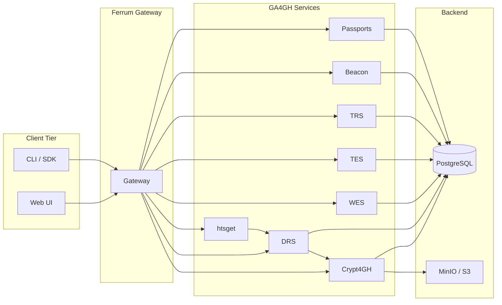
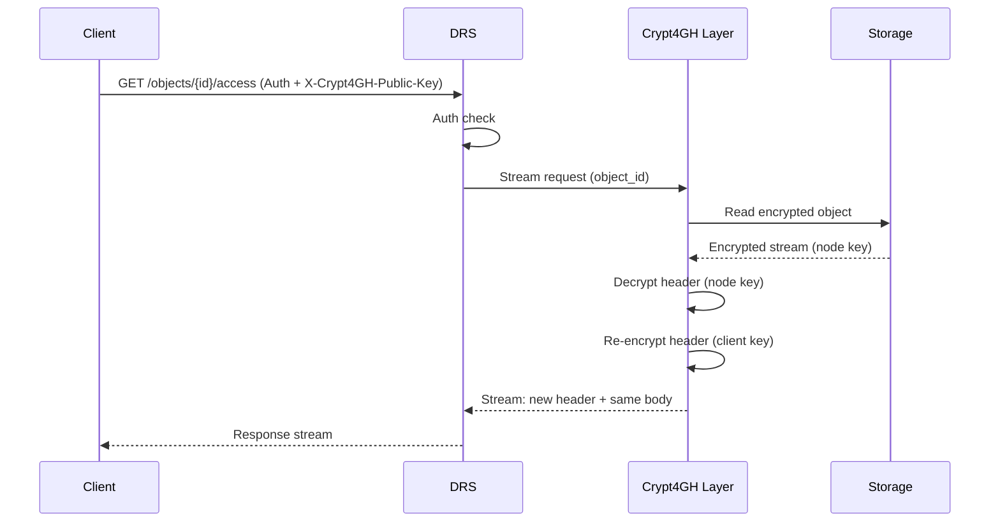

# Ferrum

<p align="center"><strong>Ferrum</strong></p>

[](https://github.com/SynapticFour/Ferrum/actions/workflows/ci.yml)
[](https://github.com/SynapticFour/Ferrum/actions/workflows/conformance.yml)
[](LICENSE)
[](https://www.rust-lang.org/)

**A complete GA4GH stack. On-premises. In Rust.**

DRS · WES · TES · TRS · Beacon v2 · htsget · Passports · Crypt4GH —
one gateway, your hardware. HelixTest demo-lifecycle CI is not GA4GH certification.

> **Legal notice:** This README describes technical capabilities, not legal advice.
> Compliance with GDPR, NIS2, EHDS, HIPAA, or other frameworks depends on the
> operator's legal basis, configuration, and organisational measures.
> See [docs/BUSINESS-MODEL.md](docs/BUSINESS-MODEL.md) for licensing details.

## SynapticFour GA4GH stack

Ferrum is the **data/compute plane** in a five-repo platform. See **[docs/ECOSYSTEM.md](docs/ECOSYSTEM.md)** for ga4gh-infra (identity), Lab Kit (deploy), Demo (benchmark), and HelixTest (conformance).

---

## Why Ferrum exists

The GA4GH standards are good. They were designed to interoperate — DRS feeds WES,
WES uses TES, TRS registers the tools, Passports control access. The complementary
design is one of GA4GH's real strengths.

The problem: most implementations cover one standard at a time. Reference
implementations exist for individual APIs. Large platforms like CanDIG or ELIXIR
cover more, but they are built for institutions with significant infrastructure
teams and cloud budgets.

There is almost no production-ready implementation that:
- covers the full GA4GH Cloud stack in a single deployable system
- runs entirely on your own hardware, with no cloud dependency
- is written in a language that makes it fast, memory-safe, and auditable

Ferrum is that implementation.

It started as an act of conviction: the standards should be used, and they should
be implementable by institutions that cannot or will not move their data to the cloud.
Clinical genomics data in particular — patient data, often under GDPR and increasingly
under EHDS — belongs on infrastructure the institution controls. Rust was the right
choice: no garbage collector, predictable latency, a smaller attack surface, and the
ability to scale to cloud if needed without rewriting.

The full integrated stack is admittedly idealistic — few existing institutions will
adopt it wholesale. But new deployments, research consortia building GA4GH-native
infrastructure, and institutions preparing for EHDS obligations now have a starting
point that didn't exist before.

Ferrum is tested continuously — unit/integration tests and clippy in CI, a **demo-stack HelixTest** job (noop TES, auth skipped, stubs labeled NON-PILOT), a **nightly HelixTest auth-on** job (`pilot.toml`, stubs off), and a Docker TES + pilot smoke on `main`. Default demo compute is
**TES noop** (API lifecycle only); use `make up-tes` for real local containers. Demo auth
defaults are open (`require_auth=false`) — pilots must use `deploy/configs/pilot.toml`.

## Operator trust model

Ferrum is intended for on-premises research and clinical-adjacent deployments. Defaults and CI are designed so a national institute can audit what is **guaranteed** versus what is **demo-only**:

| Mode | Auth | Compute | HelixTest stubs |
|------|------|---------|-----------------|
| Demo compose / `local.toml` | `require_auth=false` (explicit NON-PILOT) | TES **noop** | On (`FERRUM_TES_HELIXTEST_STUB`, `FERRUM_WES_HELIXTEST_STUBS`) |
| Pilot / production toml | `require_auth=true` | Operator TES/WES (Docker or Slurm) | Off |
| `make up-tes` | inherits overlay | Docker TES | Off |

Fail-closed behaviour (unless the demo flags above are set): JWT/Passport required when `require_auth` is on; admin APIs always require an admin visa; TES request bind-mounts require an operator prefix allowlist; htsget **rejects** genomic region queries rather than returning the whole object; WES `ferrum_backend=lsf` errors (LSF is not implemented). Full matrix: **[docs/OPERATOR-TRUST.md](docs/OPERATOR-TRUST.md)**.

Questions, pilots, or commercial licensing: [contact@synapticfour.com](mailto:contact@synapticfour.com)

---

## Where Ferrum fits

| Situation | Ferrum helps |
|-----------|-------------|
| Building GA4GH-native infrastructure from scratch | Complete stack, one deployment |
| EHDS preparation (2027–2029 deadlines) | GA4GH APIs referenced in EHDS; on-premise; audit trails |
| Clinical data that cannot leave your hardware | On-premises first, no cloud dependency |
| MII / NFDI4Health interoperability | GA4GH-compatible APIs with technical profile checks via Ferrum MII Connect |

---

## Features

| | Feature |
|---|--------|
| 🔐 | **Transparent Crypt4GH encryption** — Header re-wrapping; file bodies are designed to avoid re-encryption (O(1) per download). |
| 📦 | **GA4GH stack** — DRS, TRS, WES, TES, Beacon v2, htsget, Passports. |
| ⚡ | **Rust performance** — No GC, predictable latency, minimal footprint. TB-oriented options: [PERFORMANCE.md](PERFORMANCE.md), [docs/STORAGE-BACKENDS.md](docs/STORAGE-BACKENDS.md) (S3 multipart, bounded streaming, optional libdeflate / OpenDAL). |
| 🔬 | **Workflow engines** — Nextflow (22.10 / 23.04 advertised; TES image may be 24.10), CWL, WDL, Snakemake. |
| 🖥️ | **HPC scheduling** — Slurm. **LSF is not implemented.** |
| 📐 | **htsget** — whole-object DRS stream tickets. Region slicing (`referenceName` / `start` / `end`) returns HTTP 400. |
| 🚀 | **One-command demo** — `ferrum demo start`; Helm charts for production. |
| 📊 | **Provenance & lineage** — DAG of DRS objects and WES runs; queryable upstream/downstream, visual graph, [RO-Crate](https://w3id.org/ro/crate/1.1) export for citation. |
| 🧩 | **Ferrum MII Connect (default-17)** — offline-first technical checks of FHIR `meta.profile` against vendored MII-oriented profile metadata (default 17-module set), optional deterministic `mii sync-manifest` from pinned FHIR NPM packages, JSON/SARIF reports for ETL CI. Not a full FHIR validator or legal compliance claim. See [docs/MII-CONNECT.md](docs/MII-CONNECT.md). |
| GDPR/DSGVO support | Technical features (encryption, provenance, access control) that operators can combine with their own legal and organisational measures. See [COMPLIANCE.md](docs/COMPLIANCE.md). |
| Gaia-X principles | On-premises deployment and GA4GH APIs that can support Gaia-X-style data sovereignty; formal Gaia-X labelling requires separate assessment. |
| EHDS alignment | Uses GA4GH APIs referenced in EHDS discussions; actual EHDS compliance depends on future delegated acts and operator processes. |
| NIS2-related features | Security event log, breach alerting and SBOM tooling that can support NIS2 programmes when properly configured. |

---

## Architecture


```mermaid
flowchart LR
  subgraph Client["Client Tier"]
    UI[Web UI]
    CLI[CLI / SDK]
  end

  subgraph Gateway["Ferrum Gateway"]
    G[Gateway]
  end

  subgraph Services["GA4GH Services"]
    DRS[DRS]
    WES[WES]
    TES[TES]
    TRS[TRS]
    B[Beacon]
    P[Passports]
    HTSGET[htsget]
    C4[Crypt4GH]
  end

  subgraph Backend["Backend"]
    PG[(PostgreSQL)]
    S3[MinIO / S3]
  end

  UI --> G
  CLI --> G
  G --> DRS
  G --> HTSGET
  G --> WES
  G --> TES
  G --> TRS
  G --> B
  G --> P
  HTSGET --> DRS
  G --> C4
  DRS --> C4
  C4 --> PG
  C4 --> S3
  DRS --> PG
  WES --> PG
  TES --> PG
  TRS --> PG
  B --> PG
  P --> PG
```

---

## Quick Start

### 1. Install (macOS / Linux)

```bash
curl -sSf https://raw.githubusercontent.com/SynapticFour/Ferrum/main/install.sh | sh
export PATH="$HOME/.ferrum/bin:$PATH"
```

### 2. Start demo

**Full stack (Docker — Postgres, MinIO, UI, all GA4GH services):**

```bash
ferrum demo start
```

**Edge mode (one command, no Docker — SQLite + local storage):**

```bash
ferrum demo start --edge
```

See [docs/AFRICA-DEPLOYMENT.md](docs/AFRICA-DEPLOYMENT.md) for resource requirements (Linux, macOS, Raspberry Pi, etc.) and what is included in Edge mode. Public overview: [synapticfour.com/en/ferrum-field](https://synapticfour.com/en/ferrum-field).

### 3. Use the UI

Open **http://localhost:8082** for the UI. The gateway API is available at **http://localhost:8080**.

From a clone (without the `ferrum` CLI installer), the same stack is available via **Make**:

```bash
make up      # start demo (alias: make demo) — TES noop; auth off (NON-PILOT)
make up-tes  # demo + Docker-backed TES (real containers locally; not default)
make seed-pilot   # optional: real BAM+VCF on MinIO (after stack is up)
make smoke-pilot  # smoke: lineage, preview, cohort, WES submit
make down    # stop; keep volumes
make destroy # stop; remove volumes and project images
```

Pilot auth and compute expectations: [docs/customer-runbook.md](docs/customer-runbook.md).

### Stop / tear down

| Goal | Command |
|------|---------|
| Stop containers, **keep data** | `make down`, `make stop`, or `ferrum demo stop` |
| Remove volumes (fresh start) | `make clean` |
| Full reset (volumes + project images + build cache) | `make destroy` or `make clean-all` |

See [docs/INSTALLATION.md](docs/INSTALLATION.md#uninstall) for uninstalling the CLI and removing install directories.

---

## GA4GH Standards

| Standard | Version | Status | Endpoint |
|----------|---------|--------|----------|
| [DRS](https://ga4gh.github.io/data-repository-service-schemas/) | 1.4 | ✅ Implemented | `/ga4gh/drs/v1` |
| [WES](https://ga4gh.github.io/workflow-execution-service-schemas/) | 1.1 | ✅ Implemented | `/ga4gh/wes/v1` |
| [TES](https://ga4gh.github.io/task-execution-service-schemas/) | 1.1 | ✅ Implemented | `/ga4gh/tes/v1` |
| [TRS](https://ga4gh.github.io/tool-registry-service-schemas/) | 2.0 | ✅ Implemented | `/ga4gh/trs/v2` |
| [Beacon](https://github.com/ga4gh-beacon/beacon-v2) | 2.0 | ✅ Implemented | `/ga4gh/beacon/v2` |
| [htsget](https://samtools.github.io/hts-specs/htsget.html) | 1.3.0 | ✅ Implemented | `/ga4gh/htsget/v1` |
| [Passports](https://github.com/ga4gh-duri/ga4gh-passport-v1) | 1.0 | ✅ Implemented | `/passports/v1` |
| Crypt4GH | 1.0 | ✅ Implemented | `/ga4gh/crypt4gh/v1` |

**Lab Kit / automation:** versioned ingest at **`/api/v1/ingest`** (register, upload, job polling) — [docs/INGEST-LAB-KIT.md](docs/INGEST-LAB-KIT.md). The web UI **Data Browser** can upload via the same API when the gateway and UI are deployed together.

---

## Conformance (HelixTest)

Every push and pull request runs the open-source [HelixTest](https://github.com/SynapticFour/HelixTest) suite in **Ferrum mode** against the real demo stack (Postgres, MinIO, Keycloak, seeded data):

| CI job | What runs |
|--------|-----------|
| **HelixTest (demo lifecycle)** | `helixtest --all --mode ferrum` against the **demo** stack (noop TES, auth skipped, stubs on). **Not** GA4GH certification or institute evidence. Real Docker TES is `make up-tes` / the `test-tes` CI job. |
| **HelixTest (core services)** | Same stack, then split steps: WES + TES + DRS + TRS + Beacon, then **htsget** alone — clearer pass/fail in the Actions UI. |

Results are a **technical signal**, not official GA4GH certification (see HelixTest’s disclaimer). Default CI uses TES **noop** and skipped auth — see [customer-runbook.md](docs/customer-runbook.md). **Full matrix:** [docs/HELIXTEST-INTEGRATION.md](docs/HELIXTEST-INTEGRATION.md).

---

## Crypt4GH: Transparent Encryption

Ferrum encrypts all data at rest with **Crypt4GH**. On download, it **re-wraps the header** for the requester’s public key — the file body is never re-encrypted.


```mermaid
sequenceDiagram
  participant Client
  participant DRS
  participant Crypt4GH as Crypt4GH Layer
  participant Storage

  Client->>DRS: GET /objects/{id}/access (Auth + X-Crypt4GH-Public-Key)
  DRS->>DRS: Auth check
  DRS->>Crypt4GH: Stream request (object_id)
  Crypt4GH->>Storage: Read encrypted object
  Storage-->>Crypt4GH: Encrypted stream (node key)
  Crypt4GH->>Crypt4GH: Decrypt header (node key)
  Crypt4GH->>Crypt4GH: Re-encrypt header (client key)
  Crypt4GH-->>DRS: Stream: new header + same body
  DRS-->>Client: Response stream
```

> **O(1) re-encryption** — Only the Crypt4GH header (typically &lt; 1 KB) is re-wrapped. The body stream is passed through with zero-copy semantics. A 500 GB BAM is re-wrapped in the same time as a 1 KB file.

See [docs/CRYPT4GH.md](docs/CRYPT4GH.md) for the full design.

---

## Deployment

Deployment matrix (including offline + update strategy):
`docs/deployment/README.md`

Co-deploy with [ga4gh-infra](https://github.com/SynapticFour/ga4gh-infra) (external auth + service registry):
[docs/GA4GH-INFRA-INTEGRATION.md](docs/GA4GH-INFRA-INTEGRATION.md) · [DECISIONS.md](DECISIONS.md) (ADR-017)

### 🍎 Local demo (MacBook)

**Docker demo (full stack):**

```bash
ferrum demo start
# or: make -C . demo  (from repo)
```

**Edge mode (no Docker, single command):**

```bash
ferrum demo start --edge
```

Resource expectations and platform notes: [docs/AFRICA-DEPLOYMENT.md](docs/AFRICA-DEPLOYMENT.md). Website: [Field & offline deployment](https://synapticfour.com/en/ferrum-field).

### 🏢 On-premises HPC

```toml
# /etc/ferrum/config.toml
bind = "0.0.0.0:8080"
[database]
url = "postgres://ferrum:***@db:5432/ferrum"
[storage]
backend = "s3"
s3_endpoint = "http://minio:9000"
s3_bucket = "ferrum"
```

```ini
# systemd: ferrum-gateway.service
ExecStart=/usr/local/bin/ferrum-gateway
Environment="FERRUM_CONFIG=/etc/ferrum/config.toml"
```

### ☸️ Kubernetes

```bash
helm install ferrum ./deploy/helm -n ferrum --create-namespace -f ./deploy/helm/values-production.yaml
```

### Update operations

- Preflight: `./scripts/deployment_preflight.sh --scenario <target>`
- Docs consistency: `./scripts/docs_consistency_check.sh`
- Runbook templates:
  - `docs/deployment/UPDATE-SOP.md`
  - `docs/deployment/RELEASE-CHECKLIST.md`

---

## Workflow engines

| Engine | Language | Versions advertised in WES `service-info` | HPC backend |
|--------|----------|-------------------------------------------|-------------|
| Nextflow | Groovy/DSL2 | 22.10, 23.04 (TES default image 24.10.3) | Slurm |
| cwltool | CWL | as compiled in `ferrum-wes` | Slurm |
| Cromwell | WDL | as compiled in `ferrum-wes` | Slurm |
| Snakemake | Python | as compiled in `ferrum-wes` | Slurm |

LSF is **not** implemented: `ferrum_backend=lsf` returns a validation error. See [docs/WORKFLOWS.md](docs/WORKFLOWS.md).

---

## Provenance and lineage

Ferrum tracks which WES runs consumed which DRS objects (inputs) and produced which objects (outputs), plus manual `derived_from` links on ingest. You can query **upstream** (what produced this object) or **downstream** (what used or was derived from it), view an interactive DAG in the UI, and export a run as **RO-Crate** for citation (e.g. Zenodo/Figshare). See [docs/PROVENANCE.md](docs/PROVENANCE.md).

---

## Project structure

<details>
<summary>Click to expand <code>crates/</code> tree</summary>

```
crates/
├── ferrum-core/          # Config, DB, auth, errors, types, health, provenance
├── ferrum-storage/       # ObjectStorage: LocalStorage, S3Storage; optional OpenDAL
├── ferrum-drs/           # DRS 1.4 (objects, access, ingest)
├── ferrum-trs/           # Tool Registry Service 2.0
├── ferrum-wes/           # Workflow Execution Service 1.1
├── ferrum-tes/           # Task Execution Service 1.1
├── ferrum-beacon/        # Beacon v2
├── ferrum-htsget/        # htsget tickets (whole-object DRS stream)
├── ferrum-passports/     # GA4GH Passports & Visas
├── ferrum-crypt4gh/      # Crypt4GH encryption layer
├── ferrum-discovery/     # GA4GH Service Registry client
├── ferrum-federation/    # Peer Beacon/DRS federation
├── ferrum-security-tests/# SSRF / auth / validation tests
├── ferrum-gateway/       # API gateway composing all services
└── …                     # cohorts, workspaces, embed, ont, mii/meta-connect, reference, bench
```

</details>

---

## Contributing

We welcome contributions. See [CONTRIBUTING.md](CONTRIBUTING.md) for development setup, testing, and the PR process.

---

## License

Licensed under the **Business Source License 1.1 (BUSL-1.1)**. See [LICENSE](LICENSE) for the legal text. **Free for non-commercial research and academic use** under the Additional Use Grant. **Research vs commercial**, relation to [Ferrum Lab Kit](https://github.com/SynapticFour/Ferrum-Lab-Kit), and optional engagement models: **[docs/BUSINESS-MODEL.md](docs/BUSINESS-MODEL.md)**.

---

<div align="center">
Implementing GA4GH open standards for sovereign bioinformatics infrastructure.
© 2026 Synaptic Four · Licensed under BUSL-1.1 · Free for non-commercial research
</div>
