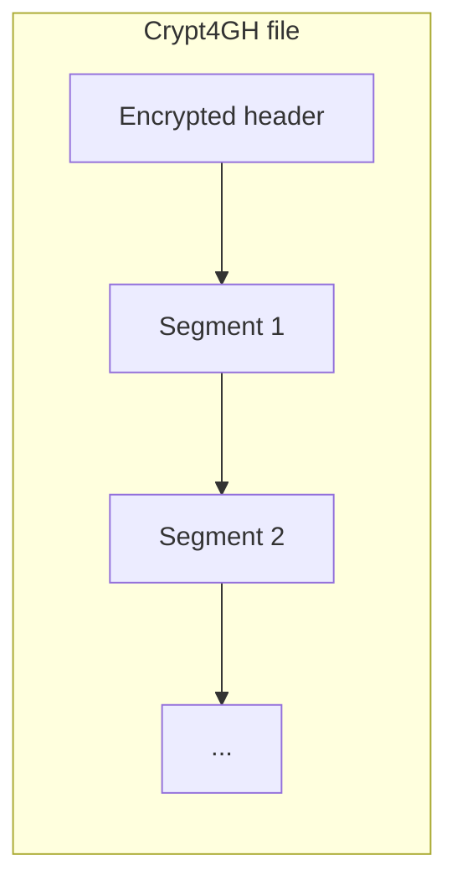
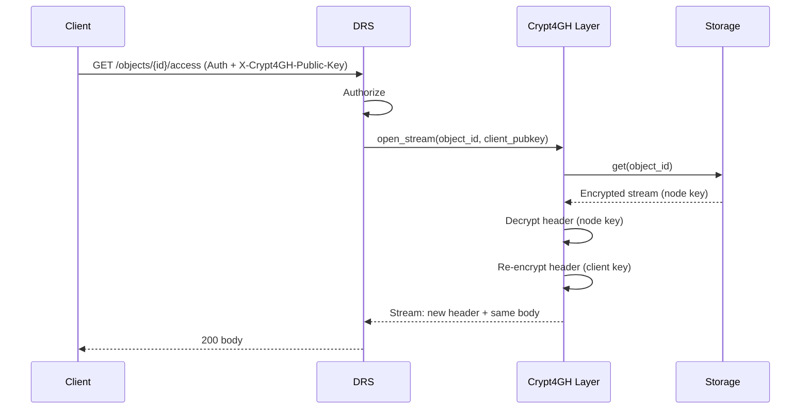

# Crypt4GH: Transparent Encryption

> Ferrum can store data encrypted at rest using Crypt4GH. By default, downloads can be **re-wrapped** for the requester’s public key (Crypt4GH on the wire). Optionally, **`GET /ga4gh/drs/v1/objects/{id}/stream`** decrypts server-side and sends **plaintext** over TLS so clients without a Crypt4GH library still see the logical file (see below).

This document describes how Crypt4GH works, Ferrum’s header re-wrapping extension, the DRS **stream** endpoint, security invariants, key exchange, key management, and client usage.

---

## How Crypt4GH works (standard)

The [Crypt4GH](https://github.com/elixir-oslo/crypt4gh) format defines:

- A **header** (encrypted with one or more recipient public keys) containing session keys and segment info.
- **Data segments** encrypted with ChaCha20-Poly1305 using keys derived from the header.

Key exchange uses **X25519**; encryption uses **ChaCha20-Poly1305**. Recipients decrypt the header with their private key to obtain the session key, then decrypt the segments.



---

## Ferrum’s extension — header re-wrapping

**Problem:** Standard Crypt4GH requires knowing all recipients at ingest time. In a multi-tenant or Passport-based system, recipients are not known in advance.

**Solution:** At ingest, Ferrum encrypts objects with a **node master key** as the sole recipient. On download, after authorization, Ferrum **re-wraps only the header** for the requester’s public key. The body is never re-encrypted.

**Upload paths:** Multipart ingest (`POST /ga4gh/drs/v1/ingest/file` and **`POST /api/v1/ingest/upload`**) can set `encrypt=true` (or `[ingest].default_encrypt_upload` on the v1 API) so the stored blob is Crypt4GH-encrypted to the node public key before `put_bytes`. Requires `crypt4gh_key_dir` and key files; see [INGEST-LAB-KIT.md](INGEST-LAB-KIT.md).

- **Ingest:** Client (or pipeline) sends plaintext or already-encrypted data; Ferrum encrypts with the node key and stores header + body.
- **Download:** Client sends auth (e.g. Passport) and `X-Crypt4GH-Public-Key`. Ferrum decrypts the header with the node key, re-encrypts the header for the client’s key, and streams **new header + same body** to the client.



> **O(1) re-encryption** — The Crypt4GH header is typically &lt; 1 KB. Re-wrapping a 500 GB BAM file takes the same time as re-wrapping a 1 KB text file. The body stream passes through with zero-copy semantics.

---

## DRS stream — plaintext to the client (decrypt at rest)

For tools and pipelines that expect a normal byte stream (e.g. plain BAM/VCF over HTTPS), Ferrum exposes:

`GET /ga4gh/drs/v1/objects/{object_id}/stream`

- **Unencrypted objects:** bytes are streamed from configured storage (`local`, `s3`, `minio`).
- **Crypt4GH-encrypted objects** (`storage_references.is_encrypted = true`): the gateway decrypts with the **node private key** from `encryption.crypt4gh_key_dir` (file `{crypt4gh_master_key_id}.sec`, default id `node`) and streams **decrypted** bytes. The client does not need Crypt4GH headers or `X-Crypt4GH-Public-Key`.

Configuration (TOML or `FERRUM_ENCRYPTION__*` env):

- `crypt4gh_key_dir` — directory containing the node `.sec` / `.pub` pair.
- `crypt4gh_master_key_id` — basename of the key files (default `node`).
- `crypt4gh_decrypt_stream` — when `false`, encrypted objects return a validation error on `/stream` (plaintext streaming disabled).

**Security note:** Plaintext leaves the server over the **TLS** connection only; it is not written to disk as part of this handler. Operators who require Crypt4GH on the wire as well should use re-wrap flows or disable this path.

---

## Security invariants

1. **Zero plaintext at rest** — Stored objects are encrypted under the node key when Crypt4GH ingest is used.
2. **In transit** — Re-wrap mode sends Crypt4GH for the client’s key. **Stream mode** sends decrypted bytes over **TLS** only (operator choice).
3. **Per-requester encryption** — Re-wrap downloads get a header encrypted for that requester’s public key.
4. **Authorization before decryption** — Access control (e.g. Passport/Visa, dataset grants) is enforced before streaming or re-wrap.
5. **Node key isolation** — The node private key is not returned to clients; it is used only server-side for decrypt/re-wrap.

---

## Key exchange protocol (random access)

For tools that need random access (e.g. `samtools`, `htseq`, `tabix`), Ferrum supports a key exchange so the client can perform decryption locally while the server streams the body.

1. Client sends a request to `/ga4gh/crypt4gh/v1/keys/exchange` with auth and temporary public key.
2. Server returns a **wrapped session key** (encrypted for the client’s key) and optional range/segment info.
3. Client decrypts the session key and uses it to decrypt the stream (or segments) received from the DRS access endpoint.

Example (conceptual):

```bash
# Request wrapped key for object (authenticated)
curl -s -H "Authorization: Bearer $TOKEN" \
  -H "X-Crypt4GH-Public-Key: $(base64 -w0 < client.pub)" \
  "https://ferrum.example.com/ga4gh/crypt4gh/v1/keys/exchange?object_id=$ID" \
  -o wrapped_key.bin
```

---

## Key management

| Store | Use case | Notes |
|-------|----------|--------|
| **LocalKeyStore** | Single-node, file-based | Keys in `/etc/ferrum/keys/` or config path |
| **DatabaseKeyStore** | Multi-node, shared keys | Keys stored encrypted in DB (optional) |
| **VaultKeyStore** | HPC / enterprise | HashiCorp Vault for key storage (optional) |

**Generate node keypair:**

```bash
ferrum keys generate
# Writes to config path, e.g. /etc/ferrum/keys/node.key, node.key.pub
```

**Rotate keys:** Run `ferrum keys rotate` to re-encrypt all object headers under a new node key. This touches only headers (metadata), not body segments; runtime depends on number of objects, not total data size.

---

## Client usage

**Download (already encrypted for your key):**

```bash
# Download
curl -H "Authorization: Bearer $PASSPORT" \
     -H "X-Crypt4GH-Public-Key: $(cat ~/.ssh/key.pub.b64)" \
     "https://ferrum.institution.edu/ga4gh/drs/v1/objects/$ID/access/https" \
     -o data.c4gh

# Decrypt with any Crypt4GH client
crypt4gh decrypt --sk ~/.ssh/key.c4gh < data.c4gh > data.bam
```

`key.pub.b64` is your public key in base64 (as required by the header format). The server re-wraps the header for this key; the response is a valid Crypt4GH file that only your private key can decrypt.

---

## Compatibility

Ferrum’s Crypt4GH layer is compliant with the **Crypt4GH v1** specification. Compatible clients include:

- [ga4gh/crypt4gh](https://github.com/elixir-oslo/crypt4gh) (reference implementation)
- [crypt4gh-rust](https://crates.io/crates/crypt4gh) (Rust)
- [crypt4gh](https://pypi.org/project/crypt4gh/) (Python)

---

*[← Documentation index](README.md)*
