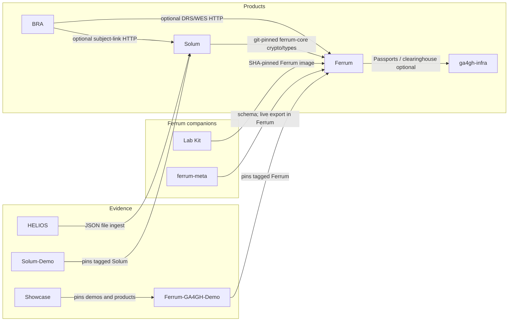

# Ferrum / GA4GH suite

These ten public repositories are from the same organisation (Synaptic Four) and can be composed. They are **not** a fifth product and **not** a bundle SKU. Each repository keeps its own version and license.

Composition is pin-based: consumers declare which tag or SHA of another repository they use. That join is not sold as one SKU. HelixTest is a related Apache conformance CLI; it is not one of these ten repositories.

**Pin join:** suite consumers (Demo, Lab Kit, Showcase, ga4gh-infra, BRA optional proxy) pin Ferrum **v0.3.2**. A green laptop run against that pin is not proof of Ferrum `main`.

## Maturity labels

| Label | Meaning |
|-------|---------|
| **Active (beta)** | Maintained; used as the data/compute or identity plane. One maintainer. Not a third-party audit. Not GA4GH certification. Not a “production-ready” claim. |
| **Early access** | Public source; evaluation / Stage-1. Expect gaps. |
| **Reference / demo** | Laptop evidence of a pinned product. Not a product, not a pilot, not production proof. |

## The ten repositories

| Repository | Role | License | Maturity |
|------------|------|---------|----------|
| [Ferrum](https://github.com/SynapticFour/Ferrum) | GA4GH data/compute plane (DRS, WES, TES, TRS, Beacon v2, htsget, Passports, Crypt4GH) | BUSL-1.1 | Active (beta) |
| [ga4gh-infra](https://github.com/SynapticFour/ga4gh-infra) | Identity plane (OIDC broker, Passports/visas, DUO, ADS, service registry). **Compose is the supported deploy.** Helm is a sketch. | Apache-2.0 | Active (beta) — Compose path |
| [Solum](https://github.com/SynapticFour/Solum) | Clinical compliance layer (consent, audit chain, FHIR interchange, field crypto) | BUSL-1.1 | Early access |
| [BioResearch Assistant](https://github.com/SynapticFour/bioresearch-assistant) | Researcher workbench (literature, phenopackets, local DRS/WES, optional Ferrum proxy) | BUSL-1.1 | Early access |
| [Ferrum Lab Kit](https://github.com/SynapticFour/Ferrum-Lab-Kit) | Ferrum companion: generate Compose / Helm / systemd around the Ferrum image. Does not implement GA4GH protocol logic. | BUSL-1.1 | Early access |
| [ferrum-meta](https://github.com/SynapticFour/ferrum-meta) | Ferrum companion: LinkML schema and archive profiles. `export` copies a committed fixture (`shutil.copyfile`); live DRS ids are Ferrum `ferrum meta export`. | Apache-2.0 | Early access |
| [HELIOS](https://github.com/SynapticFour/HELIOS) | Signed pipeline/audit evidence. Reads export JSON from disk. Does **not** call Ferrum or Solum APIs. Not a certification. | Apache-2.0 | Early access |
| [Ferrum-GA4GH-Demo](https://github.com/SynapticFour/Ferrum-GA4GH-Demo) | Laptop pipeline smoke of tagged Ferrum (DRS / WES / TES) | Apache-2.0 | Reference / demo |
| [Solum-Demo](https://github.com/SynapticFour/Solum-Demo) | Local Stage-1 walkthrough of tagged Solum (`dev-local.toml`) | Apache-2.0 | Reference / demo |
| [SynapticFour-Showcase](https://github.com/SynapticFour/SynapticFour-Showcase) | Evidence pack and pin checkout across products | Apache-2.0 | Reference / demo |

Related, not in this table: [HelixTest](https://github.com/SynapticFour/HelixTest) (GA4GH OpenAPI tests against a running target). Ferrum and BRA run HelixTest in CI; a green job is a technical signal, not GA4GH certification.

## Who consumes whom

| From → to | What actually happens |
|-----------|----------------------|
| Ferrum → ga4gh-infra | Optional external Passports (`[auth] mode = "external"`). Ferrum also has built-in passports. |
| Solum → Ferrum | Git-pinned `ferrum-core` for crypto/types. Solum is not a Ferrum module. |
| BRA → Ferrum | Optional. Set `FERRUM_DRS_URL` / `FERRUM_WES_URL`. Unset: BRA’s own local DRS/WES. |
| BRA → Solum | Optional subject-link HTTP. |
| Lab Kit → Ferrum | Generates compose/Helm/systemd around a SHA-pinned Ferrum image. |
| ferrum-meta → Ferrum | Schema in this repo; live DRS-id export is Ferrum CLI. |
| HELIOS → Solum | Reads a JSON export on disk. No Solum HTTP. |
| HELIOS → Ferrum | May hash WES artefacts as `helios run` inputs. Does not call Ferrum APIs. |
| Demos / Showcase | Pin tagged (or SHA) checkouts. A green laptop run is not production proof. |

## What this suite is not

- Not GA4GH certification.
- Not a third-party security audit.
- Not a medical device.
- Not legal advice (GDPR, EHDS, HIPAA, or otherwise).
- Not a combo SKU or a suite discount.

Questions can be sent to [contact@synapticfour.com](mailto:contact@synapticfour.com).
