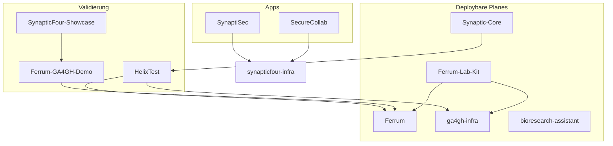

# Deployment-Audit — SynapticFour Portfolio

> **Phase 1 — Analyse only.** Stand: 2026-06-26. Keine Code-Änderungen.
> Zielbild: Customer-Sovereign Deployment (Kunde deployt selbst, kein Zugriff auf Kundeninfrastruktur).

---

## Executive Summary

Das Workspace enthält **24 Git-Repositories** unter `/Users/SynapticFour/devel/SynapticFour/`. Sie bilden mehrere Produktlinien:

| Produktlinie | Repos | Kundenrelevanz |
|--------------|-------|----------------|
| **GA4GH Data Plane** | Ferrum, ga4gh-infra, Ferrum-Lab-Kit, ferrum-meta, Open-Source-GA4GH-Stack | Hoch — Kern für Genomics-/Forschungs-Deployments |
| **Synaptic Core** | Synaptic-Core, sc-transport, sc-specs, Synaptic-Core-Test | Mittel — Plattform-Stack, noch frühe Reife |
| **Applikationen** | bioresearch-assistant, SecureCollab, SynaptiSec, PCMS, NeuroAttune | Hoch bis mittel — je nach Kunden-Pilot |
| **Mycelium Mesh** | Mycelium, mycelium-relay, mycelium-web | Mittel — Client-App + externer Relay |
| **Validierung / Demo** | HelixTest, Ferrum-GA4GH-Demo, SynapticFour-Showcase, HELIOS | Niedrig als Deploy-Unit, hoch als Nachweis |
| **Intern / Marketing** | synapticfour-business, synapticfour-infra, synapticfour-website, technical-reports | Intern — nicht direkt Kundenprodukt |

**Gesamtbild:** Kein einheitlicher Release-Prozess über alle Repos. **Ferrum + ga4gh-infra + bioresearch-assistant** sind am weitesten für souveräne Kunden-Deployments vorbereitet (Docker Compose, Offline-Bundles, teils `install.sh`, CHANGELOG, Release-Workflows). Die meisten anderen Repos haben **kein** standardisiertes Release-Artefakt (GitHub Release + SHA256 + offline Images + `install.sh` < 5 Min).

**Git-Strategie heute:** Überall `main` als Default; kurzlebige Feature-Branches existieren in CI (Dependabot). Tag-basierte Releases nur in Teilmenge (Ferrum `v*`, ga4gh-infra `ga4gh-infra-v*`, HELIOS `v*`, Synaptic-Core GHCR on `v*`). Kein durchgängiges SemVer über das Portfolio.

---

## Repo-Inventar

```
bioresearch-assistant          Ferrum                       Ferrum-GA4GH-Demo
Ferrum-Lab-Kit                 ferrum-meta                  ga4gh-infra
HELIOS                         HelixTest                    Mycelium
mycelium-relay                 mycelium-web                 NeuroAttune
Open-Source-GA4GH-Stack        perceptual-cognitive-mapping-system
sc-specs                       sc-transport                 SecureCollab
Synaptic-Core                  Synaptic-Core-Test           synapticfour-business
synapticfour-infra             synapticfour-website         SynapticFour-Showcase
SynaptiSec                     technical-reports
```

---

## Audit pro Repository

Für jedes Repo: die 8 geforderten Dimensionen.

---

### Ferrum

**Rolle:** Integrierte GA4GH Data/Compute Plane (DRS, WES, TES, TRS, Beacon, htsget, Passports, Crypt4GH).

#### 1. Stack & Build-System
- **Rust** 1.75+ Workspace (`Cargo.toml`), React/TypeScript UI (`services/ui/`, Vite, Playwright)
- **Infra-Deps:** PostgreSQL, MinIO/S3, Keycloak (Demo-Stack)
- **Build:** `cargo build`, Dockerfiles unter `deploy/`, Profile `release-edge` für Field-Binaries

#### 2. Aktueller Deploy-Prozess
- **Lokal:** `make demo` → `deploy/docker-compose.yml`
- **Varianten:** `docker-compose.tes.yml`, `.pilot.yml`, `.ga4gh-infra.yml`
- **Helm:** `deploy/helm/` (local/self-hosted/production)
- **Binary:** `install.sh` (GitHub Releases oder `--offline` lokal)
- **CI/CD:** `ci.yml`, `ghcr.yml`, **`release.yml`** (Tag `v*`), `conformance.yml`, `e2e-real.yml`

#### 3. Existierende Tests?
- **Ja, umfangreich:** `cargo test --workspace`, federated e2e (`deploy/scripts/ci-federated-e2e.sh`), HelixTest Conformance gegen live Stack, UI Playwright e2e, edge-native builds

#### 4. Datenbankmigrationen?
- **Ja:** 30+ sqlx-Migrationen in `crates/ferrum-core/migrations/` und `ferrum-embed/migrations/`
- Demo-Init: `deploy/scripts/init-demo.sh` mit Journal `_ferrum_init_migrations`
- Gateway: `FERRUM_DATABASE__RUN_MIGRATIONS` steuerbar

#### 5. Configs / Env-Variablen
- **`deploy/.env.example`** — Postgres, MinIO, Keycloak, Gateway-Ports, `FERRUM_*`
- TOML-Konfiguration dokumentiert; Preflight: `scripts/deployment_preflight.sh`

#### 6. Was kann bei schlechtem Deploy kaputt gehen?
- Schema-Drift / nicht angewandte Migrationen → Gateway-Crash
- Init-vs-Gateway-Race; Auth-Misconfig (`KEYCLOAK_JWKS_URL`) → 401
- MinIO-Bucket/Credentials → DRS-Fehler
- TES/Docker-Socket-Misconfig
- **Cross-Repo-Skew:** CI pinnt `ga4gh-infra` und `HelixTest` auf `main`

#### 7. Rollback-Mechanismus?
- **Dokumentiert:** `docs/deployment/UPDATE-SOP.md`, Helm `rollback`, Offline re-import (`docs/deployment/OFFLINE-AIRGAP.md`)
- Prior-Tag-Tarballs + `SHA256SUMS.txt` auf GitHub Releases

#### 8. Self-contained für Customer-Sovereign-Deployment?
- **Stark:** Compose, Helm, Offline export/import (`scripts/export_offline_bundle.sh`), ARM-Binaries, `RELEASING.md`, `CHANGELOG.md`
- **Lücke:** Default-Install zieht von GitHub; voll offline braucht Bundle-Workflow

---

### ga4gh-infra

**Rolle:** Identity/Access Plane (OIDC Broker, Passport/Visa, ADS, DUO, Service Registry).

#### 1. Stack & Build-System
- **Rust** Workspace (axum, sqlx, jsonwebtoken), Admin UI, Mock IdP
- Docker multi-component + native all-in-one binary

#### 2. Deploy-Prozess
- `make up` → `docker/docker-compose.yml` (Versionen aus `docker/.env.example`)
- SQLite-Variante: `docker-compose.sqlite.yml`
- Native: `scripts/install.sh`
- CI: `ci.yml`, `release-binaries.yml` (Tag `ga4gh-infra-v*`), `docker-release.yml` → GHCR

#### 3. Tests?
- Unit, testcontainers Postgres, **Docker e2e** (`scripts/e2e.sh`)

#### 4. Migrationen?
- **Ja:** pro Service unter `crates/*/migrations/`; Runtime `sqlx::migrate!()` in ADS

#### 5. Config / Env
- `docker/.env.example`, `config/all-in-one.native.toml.example`, `config/env.native.example`
- Production: `docs/production-deployment.md`

#### 6. Deploy-Risiken
- `external_url` / JWT-Iss-Mismatch → Passports abgelehnt
- Multi-Component-Tag-Koordination
- Secrets-Rotation über Services hinweg

#### 7. Rollback?
- Image-Version in `docker/.env` pinnen; `install.sh` mit `GA4GH_INFRA_VERSION=<prev>`
- Kein formales Rollback-SOP / keine dokumentierten SHA256SUMS im Binary-Release

#### 8. Self-contained?
- **Stark:** Compose, SQLite all-in-one, ARM/Raspberry Pi, vendored Docker builds, `install.sh`
- **Lücken:** kein Root-`CHANGELOG.md`/`RELEASING.md`; Checksums nicht standardisiert

---

### Ferrum-Lab-Kit

**Rolle:** Compose/Helm-Generator für selektive GA4GH-Services.

#### 1. Stack
- **Rust** CLI (`lab-kit-selector`), sqlx, YAML/TOML-Profile

#### 2. Deploy
- `lab-kit init` → `lab-kit generate compose`; Fragmente in `deploy/docker-compose/`
- `install-edge.sh` für Pi/Laptop (Beacon+DRS)
- CI: `ci.yml`, optional `conformance.yml`

#### 3. Tests?
- `cargo test`, Compose-Generation-Smoke, optional live HelixTest (manual)

#### 4. Migrationen?
- Eigene Metadata-DB: `crates/lab-kit-adapters/migrations/`; Ferrum/ga4gh-infra delegiert

#### 5. Config
- `config/lab-kit.example.toml`, `config/profiles/*.toml` — **kein `.env.example`**

#### 6. Risiken
- Placeholder-Images in generiertem Compose; Profile-Fehler; Co-Deploy-Wiring

#### 7. Rollback?
- `make down` / `make destroy` — kein Release-Artefakt

#### 8. Self-contained?
- **Moderat:** `install-edge.sh`, Field-Profile — abhängig von Ferrum/ga4gh-infra Images

---

### ferrum-meta

**Rolle:** LinkML-Metadaten-Schema (kein Runtime-Service).

#### 1–4. Stack / Deploy / Tests / Migrationen
- Python 3.10+, LinkML; `make test`; **keine DB, kein Deploy**

#### 5. Config — keine Runtime-Env

#### 6. Risiko — Schema-Änderungen brechen Ferrum-Validatoren downstream

#### 7. Rollback — Git-Tag-Pin

#### 8. Self-contained — **hoch** als Offline-Schema nach Clone; kein Release-Workflow

---

### Ferrum-GA4GH-Demo

**Rolle:** Reproduzierbarer TRS/DRS/WES/TES-Benchmark (GIAB + hap.py).

#### 1. Stack — Bash + Python 3, Docker Compose Overlays

#### 2. Deploy — `./run` / `make up`; baut/cloned Ferrum zur Laufzeit

#### 3. Tests — CI: Syntax, YAML-Validate; **kein Stack in CI**

#### 4. Migrationen — geerbt von Ferrum; `--no-reset` riskant bei Schema-Drift

#### 5. Config — env in `run`-Help; **kein `.env.example`**

#### 6. Risiken — Ferrum-Skew, 8 GB RAM, Default-Volume-Reset, Netzwerk-Abhängigkeit

#### 7. Rollback — Container down + Image-Pin; kein SOP

#### 8. Self-contained — **schwach**; Validierungsharness, nicht souveränes Release-Paket

---

### Open-Source-GA4GH-Stack

**Rolle:** Alternative GA4GH-Stack (Beacon, Sapporo/WES, Funnel/TES, DRS Starter Kit).

#### 1. Stack — Python CLI `ga4gh-community-stack`, pinned upstream Images

#### 2. Deploy — `lab-stack init/generate`; `install.sh` (PyPI); CI compose-smoke, HelixTest phases

#### 3. Tests — pytest CLI, Beacon smoke in CI

#### 4. Migrationen — MongoDB (Beacon), upstream DRS — kein eigenes Tooling

#### 5. Config — `stack.yml.example`, `config/profiles/*.env` — **kein `.env.example`**

#### 6. Risiken — `:latest` auf Sapporo/Funnel; kein Passport-Enforcement wie Ferrum

#### 7. Rollback — Image-Tags pinnen; PyPI-Version pinnen

#### 8. Self-contained — **moderat**; kein unified Offline-Bundle wie Ferrum

---

### HelixTest

**Rolle:** GA4GH-Conformance-Testharness (Client, kein Stack).

#### 1. Stack — Rust (`helixtest` CLI)

#### 2. Deploy — **keiner**; gegen laufende Ferrum/ga4gh-infra URLs

#### 3. Tests — Unit in CI; Live-Integration in Ferrum CI

#### 4–5. Keine DB / Config via CLI-Flags

#### 6. Risiko — CI green ohne Live-Suite; Checksum-Skew mit Ferrum Seeds

#### 7. Rollback — Git-Tag checkout

#### 8. Self-contained — **hoch als Offline-Testtool** nach `cargo build`; kein `install.sh`/Release-Binaries

---

### HELIOS

**Rolle:** Genomics Pipeline Audit/Compliance CLI (+ optionales Dashboard).

#### 1. Stack — Python 3.11+ (`helios-audit`), Typer, FastAPI, SQLModel

#### 2. Deploy — `pip install`; optional `docker-compose.yml` Dashboard

#### 3. Tests — 21 Testdateien, pytest+cov in CI

#### 4. Migrationen — SQLModel/SQLite lokal; **kein migrations-Verzeichnis**

#### 5. Config — `~/.helios`; **kein `.env.example`**

#### 6. Risiken — PyPI-Upgrade ohne Pin; Pipeline-Integration-Versionen

#### 7. Rollback — `pip install helios-audit==<prev>`

#### 8. Self-contained — **moderat** CLI offline; kein `install.sh`, kein Offline-Wheel-Bundle

---

### Synaptic-Core

**Rolle:** Plattform-Server (Objects, Tasks, Workflows, Gateway, Transport-Anbindung).

#### 1. Stack — Rust Workspace, `sc-server`; Docker + Compose (Postgres, MinIO)

#### 2. Deploy — `make up`; GHCR via `ghcr.yml` on `main`/`v*`

#### 3. Tests — `ci.yml` (build/test, adapter matrix, spec-drift); optional Synaptic-Core-Test/HelixTest

#### 4. Migrationen — **Policy-Datei** `migrations/0001_sc_core_schema.sql`; Runtime nutzt `CREATE TABLE IF NOT EXISTS` — **kein sqlx-Migrate-Runner**

#### 5. Config — **kein `.env.example`**; hardcoded Compose-Creds; MinIO in Compose aber **nicht an Server env gebunden**

#### 6. Risiken — Schema-Evolution ad-hoc; Default-Creds; **BUSL-1.1** Lizenz

#### 7. Rollback — `make down`/vorheriges GHCR-Tag; kein DB-Rollback

#### 8. Self-contained — **teilweise** (`make up`, `RELEASING.md`); fehlt `.env.example`, Production-Compose, Migration-Apply

---

### Synaptic-Core-Test

**Rolle:** Conformance-Harness gegen Synaptic-Core.

#### 1–4. Rust CLI; **nicht deploybar**; keine DB

#### 5. Config — `SC_TARGET`, QUIC-Flags

#### 6. Risiko — CI skip ohne laufenden Server

#### 7–8. Validierungstool für Kunden; kein eigenes Release-Paket

---

### sc-transport

**Rolle:** QUIC/SSE-Transport + SPARQ Transfer Daemon.

#### 1. Stack — Rust (`sct-core`, `sct-daemon`); `Dockerfile`, Fly.io optional

#### 2. Deploy — `make up` → `docker-compose.yml`; **kein GHCR/Release-Workflow**

#### 3. Tests — `ci.yml`, cf-check p99 gate, WAN-Tests (manual)

#### 4. Migrationen — **keine**; State in `.sct-daemon/transfers.json`

#### 5. Config — **`sct.toml`** (kein `.env.example`)

#### 6. Risiken — fehlende `sct.toml` bricht Compose; QUIC experimental; **BUSL-1.1**

#### 7. Rollback — vorheriges Image; Daemon-State snapshot

#### 8. Self-contained — **partial**; Ops-Docs vorhanden, kein Release-Pipeline

---

### sc-specs

**Rolle:** OpenAPI/AsyncAPI-Spezifikationen (CC0).

#### 1–4. YAML specs; `make validate`; **kein Deploy, keine DB**

#### 5–8. **Hoch** als Spec-Artefakt (getaggt v1.0.0); kein Compose nötig

---

### SecureCollab

**Rolle:** Homomorphe Verschlüsselung PoC (FastAPI + Next.js).

#### 1. Stack — Python 3.11+ FastAPI (TenSEAL), Next.js; Docker

#### 2. Deploy — `make up` lokal; Prod via **`ghcr-infra.yml`** → `synapticfour-infra` dispatch

#### 3. Tests — pytest 60% cov, frontend build, ruff/mypy

#### 4. Migrationen — **Alembic-Platzhalter only**; Runtime `create_db_and_tables()` + inline ALTER

#### 5. Config — `.env.example` (root + backend); SQLite default

#### 6. Risiken — **explizit PoC**, nicht production-ready; Default `SECRET_KEY`; kein Security-Audit

#### 7. Rollback — GHCR-Tag via infra; kein DB-Rollback

#### 8. Self-contained — **Demo gut**; Prod braucht externes infra-Repo + Secrets

---

### SynaptiSec

**Rolle:** SvelteKit Security-Assessment-Plattform (Postgres, optional S3).

#### 1. Stack — SvelteKit, Node 22, Postgres 16, Caddy in Compose

#### 2. Deploy — `make up`/`scripts/demo.sh`; Vercel **oder** `ghcr-infra.yml` → Hetzner

#### 3. Tests — Vitest in deploy workflows

#### 4. Migrationen — **Ja:** `migrations/001..004.sql`; Runner `scripts/migrate.mjs` — **nicht im Docker CMD**

#### 5. Config — **umfassendes `.env.example`**

#### 6. Risiken — mehrere Deploy-Pfade; Migration/Seed nicht automatisch im Container

#### 7. Rollback — GHCR/Vercel redeploy; **keine Down-Migrations**

#### 8. Self-contained — **best-in-set für Full-Stack** (Compose + Caddy + env); fehlt `install.sh`, Auto-Migrate

---

### bioresearch-assistant

**Rolle:** On-Prem Biomedical Research Platform (FastAPI + React + Postgres + Ollama).

#### 1. Stack — Python 3.12, FastAPI, Alembic, Nextflow, BLAST+, pgvector, Ollama

#### 2. Deploy — `install.py`, `docker-compose.prod.yml`; Multi-Cloud (DFN, OTC, Azure, Helm); **`build-images.yml`**, `deploy-all.yml`

#### 3. Tests — pytest+cov, MII FHIR, GA4GH smoke, **HelixTest live**, frontend build

#### 4. Migrationen — **Alembic** `001..008`; Deploy-SSH führt `alembic upgrade head` aus — **nicht im Dockerfile CMD**

#### 5. Config — **`.env.example`** umfangreich; Preflight-Szenarien

#### 6. Risiken — `:latest` in prod compose; große Images; BUSL-1.1; viele Deploy-Pfade

#### 7. Rollback — **`docs/deployment/UPDATE-SOP.md`**; Image-Pin, Helm rollback, Offline re-import

#### 8. Self-contained — **sehr hoch** (Air-gap bundle, DFN/OTC, K8s Helm, Ollama lokal)

---

### Mycelium

**Rolle:** P2P-Mesh Client (Rust, Android, Desktop/Tauri).

#### 1. Stack — Rust workspace, Kotlin Android, Svelte/Tauri Desktop

#### 2. Deploy — APK/Play Store, Desktop releases; **kein Server-Compose für Prod**

#### 3. Tests — ci.yml, android-ci, codeql

#### 4. Migrationen — sled embedded lokal

#### 5. Config — Build-time env; **kein `.env.example`**

#### 6. Risiken — Early beta; Bootstrap hardcoded in `bootstrap.rs`; **AGPL-3.0**

#### 7. Rollback — Store/APK artifact rollback

#### 8. Self-contained — **Client-App**, nicht self-hosted Server; Relay extern

---

### mycelium-relay

**Rolle:** Öffentlicher libp2p-Relay (Fly.io).

#### 1. Stack — Rust subset; `Dockerfile.relay`

#### 2. Deploy — **`deploy.yml`** auto auf push → Fly.io; `deploy/relay/README.md`

#### 3. Tests — ci.yml ubuntu+macOS

#### 4. Migrationen — keine; Identity auf Fly Volume

#### 5. Config — `MYCELIUM_STORAGE_KEY` (Fly secret)

#### 6. Risiken — Peer-ID ändert sich ohne Storage Key; SynapticFour-hosted, nicht kundensouverän

#### 7. Rollback — `fly deploy` previous image

#### 8. Self-contained — Fly-spezifisch; Kunde müsste eigenen Relay deployen (AGPL)

---

### mycelium-web

**Rolle:** Statische Marketing-Site.

#### 1. Stack — Static HTML, Node build script

#### 2. Deploy — Vercel (primary); manual `deploy.yml`

#### 3. Tests — ci.yml build+check

#### 4–5. Keine DB; `.env.example` (Formspree, base URL)

#### 6–8. **Hoch** als statisches Hosting; kein CHANGELOG

---

### NeuroAttune

**Rolle:** Local-first Flutter App (Wearables, on-device ML).

#### 1. Stack — Flutter/Dart, SQLite/sqlcipher

#### 2. Deploy — App Store / sideload; **kein Server**

#### 3. Tests — flutter analyze/test in ci.yml

#### 4. Migrationen — lokale SQLite (`scripts/data_migration/`)

#### 5–8. **Sehr hoch** Datensouveränität (on-device); kein Release-Automation in CI

---

### perceptual-cognitive-mapping-system (PCMS)

**Rolle:** Next.js Research Assessment; Prod: map.synapticfour.com.

#### 1. Stack — Next.js 16, Supabase client, Vitest, Playwright

#### 2. Deploy — **Vercel default**; Self-host nur in Docs (`docs/DEPLOYMENT.md` Template)

#### 3. Tests — ci.yml (validators, vitest, Playwright e2e, build)

#### 4. Migrationen — **Supabase SQL** in `supabase/migrations/` (6 Dateien); manuell via Supabase CLI

#### 5. Config — `.env.example`; Offline-Fallback localStorage ohne Supabase

#### 6. Risiken — Vercel+Supabase SaaS; Free-Tier Pause; CSP hardcoded Supabase

#### 7. Rollback — Vercel instant; Supabase Backup manuell

#### 8. Self-contained — **mittel**; kein Repo-Dockerfile; Cloud-Pfad ist Default

---

### SynapticFour-Showcase

**Rolle:** Multi-Repo Demo-Orchestrierung + statische Ergebnis-Artefakte.

#### 1. Stack — Bash + Python; orchestriert Ferrum-GA4GH-Demo, HELIOS, optional BRA

#### 2. Deploy — lokal only (`make up`); **kein Prod-Workflow**

#### 3. Tests — ci.yml script smoke

#### 4–5. Keine eigene DB; `PINNED_VERSIONS.txt`

#### 6. Risiken — Sibling-Repo-Abhängigkeit; 8–12 GB RAM

#### 7–8. **Hoch** lokal; statische Artefakte in `demo/results/` ohne Install

---

### synapticfour-business

**Rolle:** Internes Business-OS + Kunden-Pilot-Orchestrierung.

#### 1. Stack — Markdown + Fly.io Pilot-Wrapper (Ferrum, ga4gh-infra, Keycloak)

#### 2. Deploy — `./pilot.sh deploy` (Fly Frankfurt); CI: `pilot-deploy.yml`

#### 3. Tests — Post-deploy health; keine App-Unit-Tests

#### 4. Migrationen — delegiert an Ferrum/ga4gh-infra

#### 5. Config — `pilot-deploy/.env.example`; Fly secrets

#### 6. Risiken — **Pilot ≠ Production**; Ferrum pinned auf `main`; SynapticFour-hosted Fly

#### 7. Rollback — pause/teardown; kein Fly release rollback

#### 8. Self-contained — **mittel via `self-deployment-pack/`**; Fly-Pilot nicht souverän

---

### synapticfour-infra

**Rolle:** Multi-App IaC (Hetzner) für SynaptiSec + SecureCollab.

#### 1. Stack — OpenTofu/Terraform 1.9, Hetzner Cloud, GHCR

#### 2. Deploy — manual `infrastructure.yml` + `deploy.yml`; SSH zu `/opt/<app>`

#### 3. Tests — tofu validate (teilweise `continue-on-error`)

#### 4. Migrationen — synaptisec: `npm run db:migrate` post-deploy; securecollab: **leer**

#### 5. Config — `terraform.tfvars.example`; GitHub Environment Secrets

#### 6. Risiken — alles manual; Single-VM; keine HA

#### 7. Rollback — redeploy prior `image_tag`; docs in MIGRATION-SYNAPTISEC-MULTIAPP

#### 8. Self-contained — **hoch als VM-Pattern** den Kunde übernehmen kann; SynapticFour-operated heute

---

### synapticfour-website

**Rolle:** Marketing (synapticfour.com).

#### 1. Stack — Astro 6 + Tailwind, Node 22

#### 2. Deploy — manual GitHub Pages

#### 3. Tests — ci.yml build + link check

#### 4–8. Statisch, **hoch souverän**; manual deploy drift

---

### technical-reports

**Rolle:** Quarto SF-TR Publikationen + Zenodo.

#### 1. Stack — Quarto, Markdown, BibTeX

#### 2. Deploy — GitHub Release + Zenodo; kein Runtime

#### 3. Tests — Render matrix in CI

#### 4–8. **Sehr hoch** offline render; Zenodo optional

---

## Cross-Repo-Beobachtungen

### Deployment-Abhängigkeiten



### Release-Artefakt-Reife (Zielbild Phase 2)

| Artefakt | Ferrum | ga4gh-infra | BRA | Synaptic-Core | SecureCollab | SynaptiSec | Rest |
|----------|:------:|:-----------:|:---:|:-------------:|:------------:|:----------:|:----:|
| `Dockerfile` + Compose | ✅ | ✅ | ✅ | ✅ | ✅ | ✅ | teils |
| `.env.example` | ✅ | ✅ | ✅ | ❌ | ✅ | ✅ | oft ❌ |
| `install.sh` | ✅ | ✅ | `install.py` | ❌ | ❌ | ❌ | selten |
| `CHANGELOG.md` | ✅ | ⚠️ | ✅ | ✅ | ✅ | ✅ | oft ❌ |
| Tag-Release + SHA256 | ✅ | ⚠️ | ⚠️ | ⚠️ | ❌ | ❌ | ❌ |
| Offline Image Export | ✅ | ⚠️ | ✅ | ❌ | ❌ | ❌ | ❌ |
| `release.yml` (v*.*.*) | ✅ | ⚠️ | ⚠️ | ⚠️ | ❌ | ❌ | ❌ |
| `ci.yml` PR-Gate | ✅ | ✅ | ✅ | ✅ | ✅ | ⚠️ | variiert |

### Lizenz-Mix (Kunden-Impact)

| Lizenz | Repos |
|--------|-------|
| BUSL-1.1 | Ferrum (Teile), Synaptic-Core, sc-transport, bioresearch-assistant |
| AGPL-3.0 | Mycelium, mycelium-relay |
| Apache-2.0 | SecureCollab, Synaptic-Core-Test, ga4gh-infra, HelixTest |
| CC0 | sc-specs |
| Proprietär / Docs | synapticfour-business, synapticfour-infra |

### Top-Risiken bei erstem Kunden-Testzugriff

1. **Kein einheitliches Release-Bundle** pro Produktlinie — Kunde muss mehrere Repos + Secrets kennen
2. **Cross-Repo Version Skew** — CI pinnt `main` für ga4gh-infra, HelixTest, Ferrum in Pilot
3. **Migrationen nicht container-start-sicher** — SynaptiSec, BRA, SecureCollab (Alembic fehlt)
4. **SynapticFour-infra-Abhängigkeit** — SecureCollab/SynaptiSec Prod braucht PAT + externes Repo
5. **Default-Credentials / PoC-Status** — SecureCollab, Synaptic-Core Compose
6. **Kein standardisierter Rollback** außer Ferrum/BRA dokumentiert

---

## Empfohlene Phase-2-Priorisierung (Vorschlag)

| Prio | Produkt | Begründung |
|------|---------|------------|
| P0 | **Ferrum + ga4gh-infra** | Erste Kunden-Piloten (Pasteur-Pack); am weitesten — Lücken schließen (SHA256 überall, vereinheitlichtes `release.sh`) |
| P0 | **bioresearch-assistant** | Bereits souverän — `:latest` eliminieren, `install.sh` vereinheitlichen |
| P1 | **Synaptic-Core Stack** | Plattform-Zukunft — `.env.example`, Migration-Runner, Release-Pipeline |
| P1 | **SynaptiSec** | Kunden-Compose fast fertig — `install.sh`, Auto-Migrate, von infra entkoppeln |
| P2 | **SecureCollab** | Erst nach Security-Audit + Alembic |
| P2 | **Mycelium** | Client-Distribution, nicht Compose-Release |
| P3 | **PCMS, Website, technical-reports** | Separate Deploy-Modelle (SaaS vs static) |

---

*Erstellt in Phase 1. Keine Code-Änderungen. Warte auf Bestätigung für Phase 2.*
